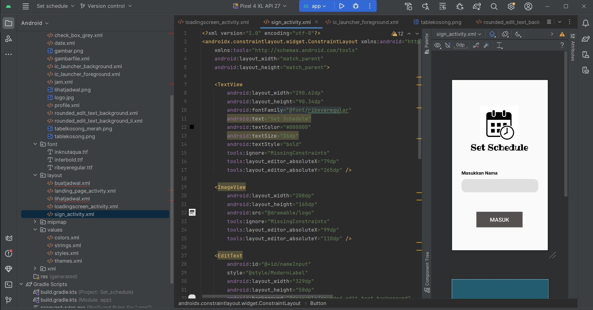
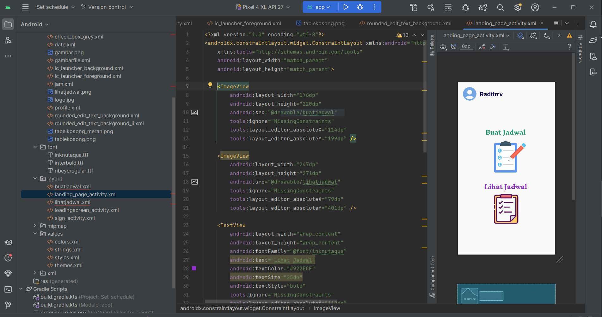
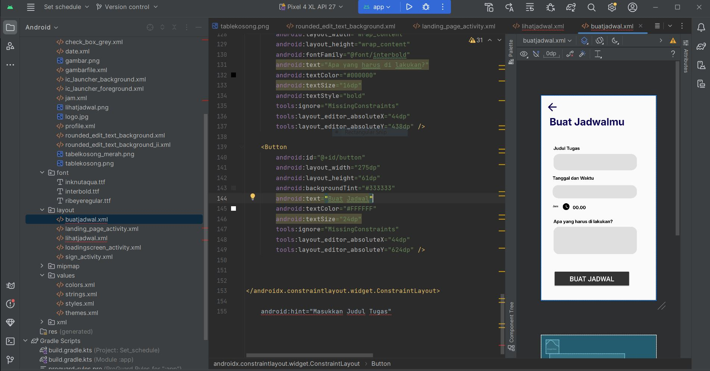
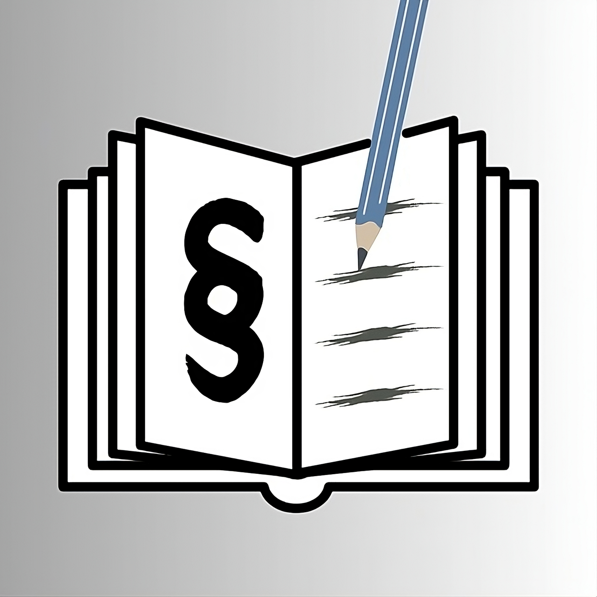
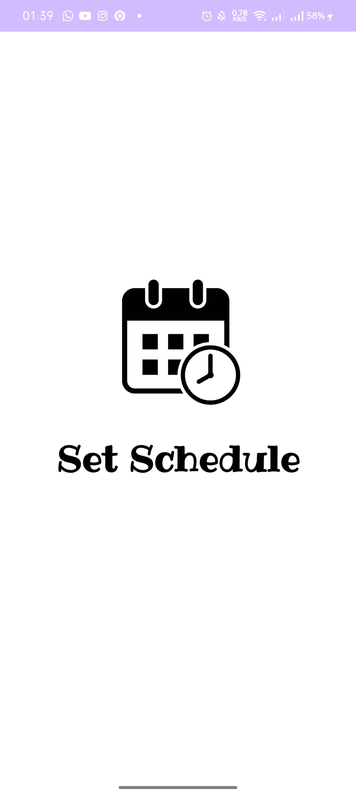
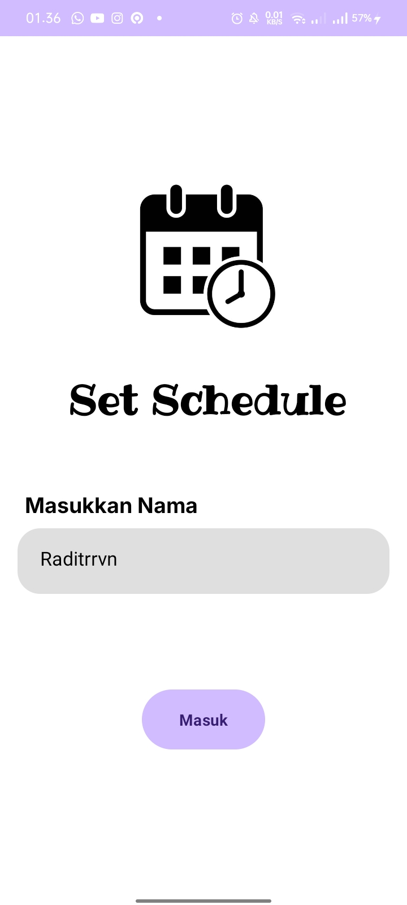
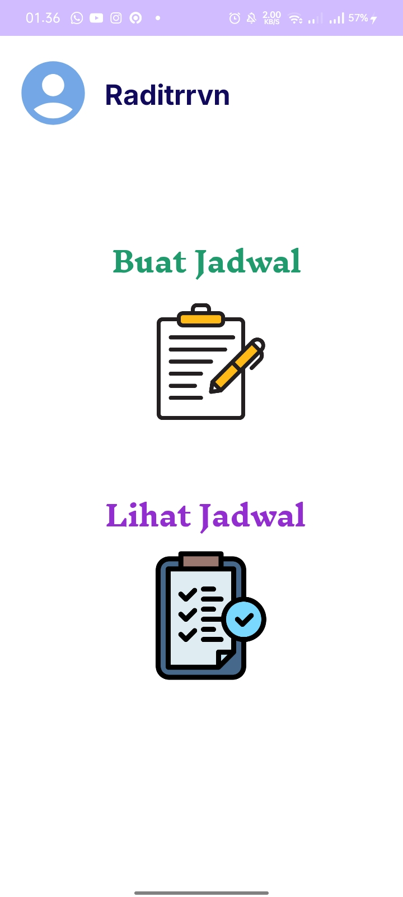
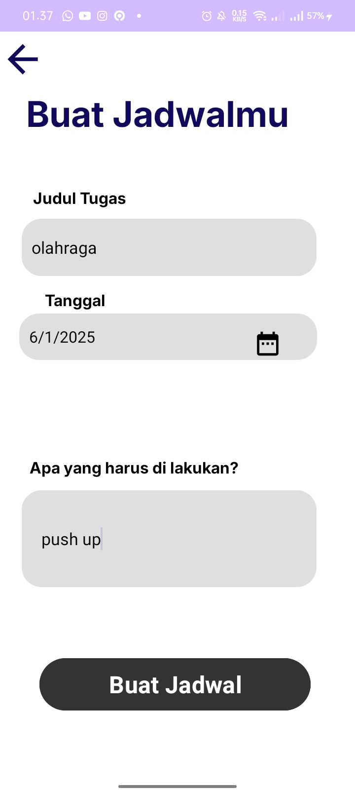
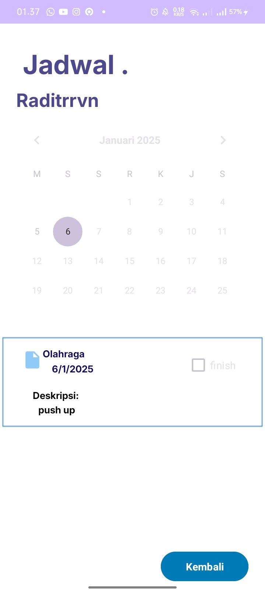

# Project UTS { Semester 3 } 

## Profil
|  |  |
| -------- | --- |
| **Nama** | Raditra Ikhwanul Arifin |
| **Kelas** | TI.23.A5 |
| **Mata Kuliah** | Pemrograman Mobile 1 |

# Set Schedule App

**Set Schedule** adalah sebuah aplikasi berbasis Android yang dirancang untuk membantu pengguna mengatur dan mengelola jadwal mereka. aplikasi ini memungkinkan pengguna untuk membuat, menyimpan, dan melihat jadwal harian atau acara tertentu dengan tampilan yang sederhana dan intuitif. Aplikasi ini dirancang untuk memberikan pengalaman pengguna yang mudah digunakan, membantu meningkatkan produktivitas, dan memastikan pengguna tidak melewatkan aktivitas penting.

## Output

***Keterangan :***

- Berikut adalah tampilan awal apabila ``telah berhasil di RUN`` di awali dengan judul aplikasi **Set Schedule**.

## Output

***Keterangan :***

- Setelah menunggu beberapa detik, ``maka akan pergi menuju menu sign in untuk memasukkan nama pengguna``

## Output 

***Keterangan :***

- Selanjutnya, bisa langsung ``klik tombol MASUK``. Maka, tampilannya akan berubah untuk masuk ke Halaman utama.

## Output

***Keterangan :***

- Selanjutnya, Untuk membuat jadwal ``klik tombol buat jadwal``. Maka, tampilannya akan berubah untuk masuk ke detail pembuatan jadwal.

## Output

***Keterangan :***

- Selanjutnya, setelah membuat jadwal kita bisa melihat jadwal yang sudah kita buat ``dengan mengklik tombol Lihat Jadwal`` maka kita akan bisa melihat jadwal apa saja yang telah kita buat, klik tombol kembali untuk menuju kembali ke halaman utama

## Status Proyek: **Phase 2 - Enhancing the Design**

Pada tahap ini kami berfokus untuk meningkatkan kualitas desain aplikasi untuk memberikan tampilan yang lebih modern, menarik, dan responsif. Perubahan desain mencakup:
## Apa yang Baru di Phase 2?

- Penyesuaian tata letak pada setiap Halaman.
- Penyesuaian Button, terutama pada halaman utama.
- Peningkatan ikon dan elemen grafis agar lebih modern.
- Penambahan Profil user pada halaman Utama.
- Penambahan Launcher Icon baru untuk identitas aplikasi.

### Launcher Icon

Berikut ini adalah icon aplikasi Set Schedule

## Penjelasan Halaman Aplikasi

### 1. Splash Screen

Berikut ini adalah Halaman pertama yang muncul dengan menampilkan logo dan nama aplikasi dari Set Schedule.

### 2. Sign in

Halaman Selanjutnya yaitu Halaman Sign In yang bertujuan untuk meng input nama User dari aplikasi Set Schedule ini

### 3. Beranda

Halaman utama setelah memasukan nama user ke dalam aplikasi. Menampilkan informasi utama seperti:

- Buat Jadwal
- Liat Jadwal

### 4. Input Jadwal

Selanjutnya Halaman ini Digunakan untuk menginput data kegiatan, seperti:

- Masukan Judul Tugas.
- Sesuaikan Tanggal/Bulan/Tahun.
- Masukan kegiatan apa saja yang ingin di lakukan.

### 5. Lihat Jadwal

Setelah Jadwal berhasil dibuat, User akan diarahkan ke halaman ini. yang berfungsi untuk:

- Melihat jadwal tugas yang sudah di buat sebelumnya 
- Menyelesaikan tugas apabila sudah selesai, dengan cara klik pada tumbol kotak centang.

## SELESAI  